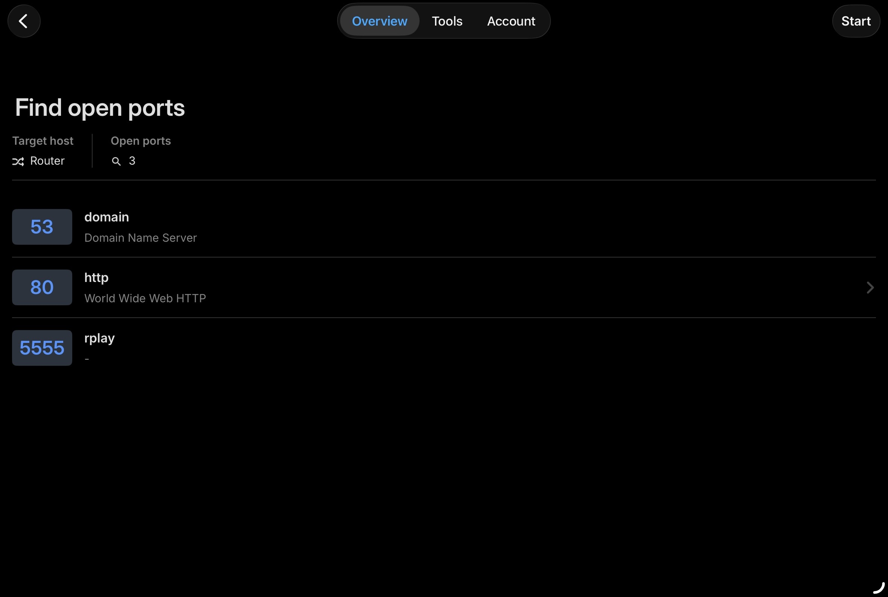
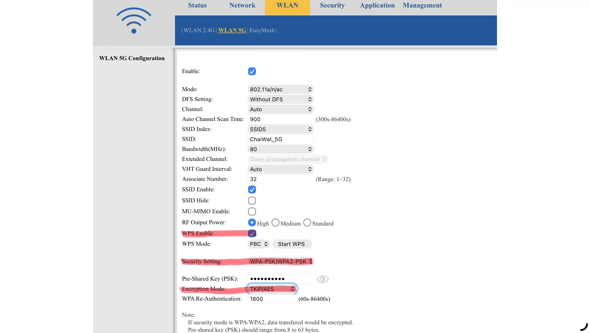
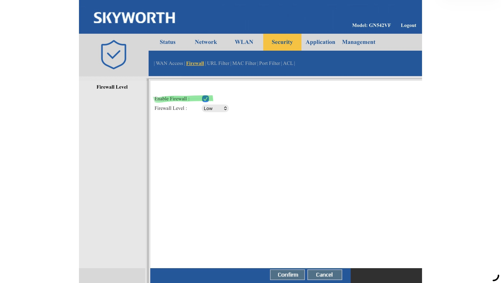

# Home Network Security Audit & Hardening Report

## 1. Executive Summary

Performed a vulnerability assessment and security hardening of an ISP-provided residential gateway. The assessment used Fing (iOS) for network reconnaissance and the router's web management interface for configuration changes. Four findings were identified: deprecated wireless encryption, WPS enabled by default, firewall inactive, and legacy unencrypted protocols open on the LAN. Three were fully remediated. The fourth is an accepted risk due to ISP firmware restrictions that prevent customer-level changes to LAN ACL rules.

---

## 2. Scope & Environment

| Field | Detail |
|-------|--------|
| Target Device | Skyworth GN542VF (ISP: True Online) |
| Local Subnet | `192.168.1.0/24` |
| Assessment Tools | Fing Network Scanner (iOS), Router Web Management Interface |

---

## 3. Initial Reconnaissance & Baseline

An ARP sweep and port scan were run against the local subnet to establish a baseline inventory.

**Device Inventory:** Identified all active endpoints. Generic hostnames were resolved using MAC address lookup to identify specific devices, including a Smart Camera and TrueID TV Box.

**Open Ports (Gateway):**

| Port | Service | Notes |
|------|---------|-------|
| 53 | DNS | Expected |
| 80 | HTTP | Router management interface |
| 5555 | rplay | Identified by Fing; likely the TrueID TV Box's AirPlay receiver service |

Port 5555 running rplay is expected behavior for a media box with AirPlay support. It's worth noting as an open service — if the TrueID box has unpatched firmware vulnerabilities, this port is a potential entry point for anyone already on the network.

---

## 4. Vulnerability Findings & Remediation

### Finding 1: Deprecated Cryptographic Protocols

**Severity:** High
> TKIP vulnerabilities give an attacker a direct path to recovering the network passphrase without needing physical access. Mixed mode makes it worse — the network is only as strong as its weakest client.

**Observation:** Both the 2.4GHz and 5GHz bands were running WPA-PSK/WPA2-PSK Mixed Mode with TKIP/AES encryption.

**Risk:** TKIP is obsolete and vulnerable to downgrade and key-recovery attacks. Mixed mode is the problem — it allows a client or attacker to force negotiation down to TKIP, effectively bypassing the stronger AES protection entirely.

**Remediation:** Enforced WPA2-PSK with AES (CCMP) exclusively across both bands. Mixed mode disabled.

**Troubleshooting:** Applying the change to the 5GHz band returned a firmware error: `"This SSID has already been used by SSID6"`. Investigation revealed a hidden duplicate SSID profile (`ChaiWat_5G_Ghost`) causing an internal conflict. The ghost profile was renamed and disabled, which cleared the conflict and allowed the configuration change to apply successfully.

---

### Finding 2: WPS Enabled by Default

**Severity:** High
> Password complexity is irrelevant here. The Pixie Dust attack bypasses the WPA2 passphrase entirely by attacking the WPS PIN exchange — a strong password provides zero additional protection while WPS is active.

**Observation:** WPS was enabled on both wireless bands out of the box.

**Risk:** WPS PIN authentication is vulnerable to the Pixie Dust attack, an offline cryptographic attack that exploits weak nonce generation in WPS implementations to recover the plaintext WPA2 passphrase regardless of password complexity.

**Remediation:** Disabled WPS on all active radios.

---

### Finding 3: Firewall Disabled, WAN Ping Responding

**Severity:** Medium
> Unlike Findings 1 and 2, this doesn't hand an attacker the passphrase directly. The risk here is increased exposure and discoverability — a disabled firewall with a responding WAN ping makes the device an easier target, but exploitation still requires an additional step.

**Observation:** The gateway's SPI (Stateful Packet Inspection) firewall was off by default. The WAN interface was also configured to respond to external ICMP ping requests.

**Risk:** A disabled SPI firewall removes the primary filter against unsolicited inbound traffic. A responding WAN ping makes the device visible to automated internet-wide scanners, increasing exposure to opportunistic attacks.

**Remediation:** Enabled the IPv4 SPI firewall (Low setting) and disabled WAN ping response. External ICMP requests are now dropped silently.

---

### Finding 4: Legacy Protocols Open on LAN (Unresolved)

**Severity:** Medium
> This requires an attacker to already have LAN access, which is why it sits at Medium rather than High. It's a meaningful post-compromise risk, but not an initial access vector on its own. Remediating Finding 1 reduces the likelihood of unauthorized LAN access in the first place.

**Observation:** The LAN ACL has Telnet, FTP, and TFTP enabled on the LAN interface.

**Risk:** Telnet transmits all data in cleartext, including credentials. If any internal device is compromised, an attacker with LAN access can intercept administrative sessions via passive sniffing.

**Remediation Status:** Unresolved — Accepted Risk.

**Notes:** The ISP firmware uses hardened RBAC that restricts customer accounts from modifying LAN ACL rules. These ports are almost certainly open for ISP field technician access and TR-069 remote management. There is no legitimate way to close them at the customer level without flashing custom firmware, which would void ISP support and likely break provisioning. Residual risk is partially offset by the WPA2-AES enforcement from Finding 1, which raises the bar for unauthorized LAN access. This remains a documented limitation.

---

### Screenshots

📁 [View all before/after configuration screenshots](screenshots/)

---

## 5. Summary

| Finding | Severity | Status |
|---------|----------|--------|
| TKIP/Mixed Mode wireless encryption | High | Remediated |
| WPS enabled by default | High | Remediated |
| SPI firewall disabled, WAN ping active | Medium | Remediated |
| Telnet/FTP/TFTP open on LAN (ISP firmware) | Medium | Accepted Risk |

Three of four findings were fully remediated through the router's web interface. The remaining finding is a vendor limitation with no available fix at the customer privilege level. It is documented here as an accepted risk, not an oversight.

---

## 6. Key Concepts & Lessons Learned

This section breaks down the technical terms used throughout the report. Written for review — so coming back to this later still makes sense without re-reading the whole thing.

---

### Wireless Encryption

**TKIP (Temporal Key Integrity Protocol)**
TKIP was introduced as a stopgap fix for the original WEP encryption, which was completely broken. It was never meant to be a long-term solution. The core problem is that TKIP reuses components of WEP's flawed design — an attacker can exploit this to perform a key-recovery attack and decrypt traffic. It was officially deprecated by the IEEE in 2012. Any network still running TKIP in 2025 is running a protocol that the industry retired over a decade ago.

**AES-CCMP**
AES (Advanced Encryption Standard) with CCMP (Counter Mode with Cipher Block Chaining Message Authentication Code Protocol) is the current standard for wireless encryption. Unlike TKIP, CCMP was built from scratch on a solid cryptographic foundation. When you configure WPA2 to use AES, this is what you're actually enabling. It's what "WPA2" means in practice when configured correctly.

**WPA2-PSK Mixed Mode**
Mixed mode allows both WPA (using TKIP) and WPA2 (using AES) clients to connect to the same network. The intent was backwards compatibility with older devices. The problem is that the network will fall back to the weaker TKIP protocol if any client requests it — including an attacker deliberately posing as a legacy client. Mixed mode means your security ceiling is set by the weakest device on the network, not the strongest. Always use WPA2-only with AES.

---

### WPS & The Pixie Dust Attack

**WPS (Wi-Fi Protected Setup)**
WPS was designed to make connecting devices easier — instead of typing a long password, you either press a physical button on the router or enter an 8-digit PIN. The PIN method is where it falls apart. The PIN is verified in two halves, which means an attacker doesn't need to brute-force all 100 million possible 8-digit combinations — they only need to crack each 4-digit half separately, reducing the search space to around 11,000 attempts. That alone is a problem, but Pixie Dust makes it worse.

**Pixie Dust Attack**
Pixie Dust is an offline attack that targets the WPS PIN exchange. During the WPS handshake, the router generates two random secret values (nonces) to prove it knows the PIN. On many router chipsets, these nonces are generated from a weak or predictable seed — meaning they're not truly random. An attacker captures the WPS handshake, then uses that captured data offline to reconstruct the nonces and recover the PIN without sending a single additional packet to the router. Once the PIN is known, it can be used to retrieve the full WPA2 passphrase. The entire attack can take under a minute on vulnerable hardware. A 20-character random password does nothing to stop it.

---

### Firewall & Network Perimeter

**SPI Firewall (Stateful Packet Inspection)**
A basic packet filter checks individual packets in isolation — it only looks at the header (source IP, destination IP, port) to decide whether to allow or block. SPI goes further by tracking the *state* of active connections. It knows the difference between a packet that's part of an established, legitimate session and an unsolicited packet arriving from the outside with no corresponding outbound request. This matters because attackers often send crafted packets designed to look legitimate to a basic filter. SPI catches those by checking whether the connection they claim to belong to actually exists.

**WAN Ping (ICMP Echo Request)**
ICMP is the protocol behind the `ping` command. When WAN ping is enabled, your router responds to ping requests from the public internet. This sounds harmless but it tells anyone scanning the internet that your IP address has a live, responsive device behind it. Automated scanners constantly sweep large IP ranges looking for live hosts to probe further. Disabling WAN ping doesn't make you invisible — your IP is still allocated — but it removes the confirmation signal that makes your device worth investigating further. This is what "stealth mode" means in the context of a consumer router.

---

### Legacy Protocols

**Telnet**
Telnet is a remote login protocol from 1969. Everything transmitted over Telnet — including usernames, passwords, and commands — is sent in plaintext. Anyone on the same network running a packet capture tool like Wireshark can read Telnet sessions as clearly as reading a text file. It was superseded by SSH (Secure Shell), which encrypts the entire session. There is no legitimate reason to use Telnet in 2025 unless a vendor has hardcoded it into firmware and given you no choice, which is exactly what happened here.

**FTP / TFTP**
FTP (File Transfer Protocol) has the same problem as Telnet — credentials and file contents are transmitted in cleartext. SFTP (SSH File Transfer Protocol) and FTPS (FTP over SSL) are the encrypted alternatives. TFTP (Trivial FTP) is a stripped-down version of FTP with no authentication at all, commonly used by network devices for firmware updates and configuration backups on the local network. Its presence here is almost certainly for ISP provisioning purposes.

**TR-069**
TR-069 is a standard protocol that allows ISPs to remotely manage customer-premises equipment (CPE) — routers, modems, TV boxes — from a central server called an ACS (Auto Configuration Server). Through TR-069, an ISP can remotely push firmware updates, change configuration, and pull diagnostic data from your router without any interaction on your end. It runs over HTTP/HTTPS on the WAN side. The open Telnet/FTP/TFTP ports on the LAN side of this router are almost certainly related to ISP technician access and TR-069 provisioning workflows. This is why they cannot be closed — the ISP depends on them.

---

### Access Control

**ACL (Access Control List)**
An ACL is a set of rules that defines what traffic is allowed or denied on a network interface. Each rule specifies conditions (source IP, destination port, protocol) and an action (allow or deny). On this router, the LAN ACL controls which protocols are permitted to communicate with the gateway from inside the network. The Telnet/FTP/TFTP entries exist as explicit allow rules in this ACL that the customer account cannot modify.

**RBAC (Role-Based Access Control)**
RBAC assigns permissions based on roles rather than individual users. On this ISP router, there are at minimum two roles: ISP administrator (full access) and customer administrator (restricted access). The ISP admin role has the ability to modify LAN ACL rules; the customer role does not. This is standard practice for ISP-provided equipment — the ISP needs to maintain control over provisioning and diagnostics regardless of what the customer does with the device.

---

### Reconnaissance Tools & Techniques

**ARP Sweep**
ARP (Address Resolution Protocol) maps IP addresses to MAC addresses on a local network. An ARP sweep sends ARP requests to every IP in a subnet range and listens for responses. Any device that responds is active on the network. This is how Fing builds its device list — it sweeps the subnet and collects MAC addresses, then uses MAC vendor lookup tables to identify the manufacturer of each device. That's how a generic hostname becomes "Samsung Smart Camera" or "Apple iPhone."

**MAC Address Lookup**
Every network interface card has a MAC address — a 48-bit hardware identifier. The first 24 bits (the OUI, Organizationally Unique Identifier) are assigned to the device manufacturer by the IEEE. Public OUI databases map these prefixes to company names. When Fing resolves a generic hostname to a specific device type, it's doing a MAC OUI lookup against one of these databases. This is a core technique in network reconnaissance — a device can hide its hostname, but its MAC address always reveals who made the hardware.
